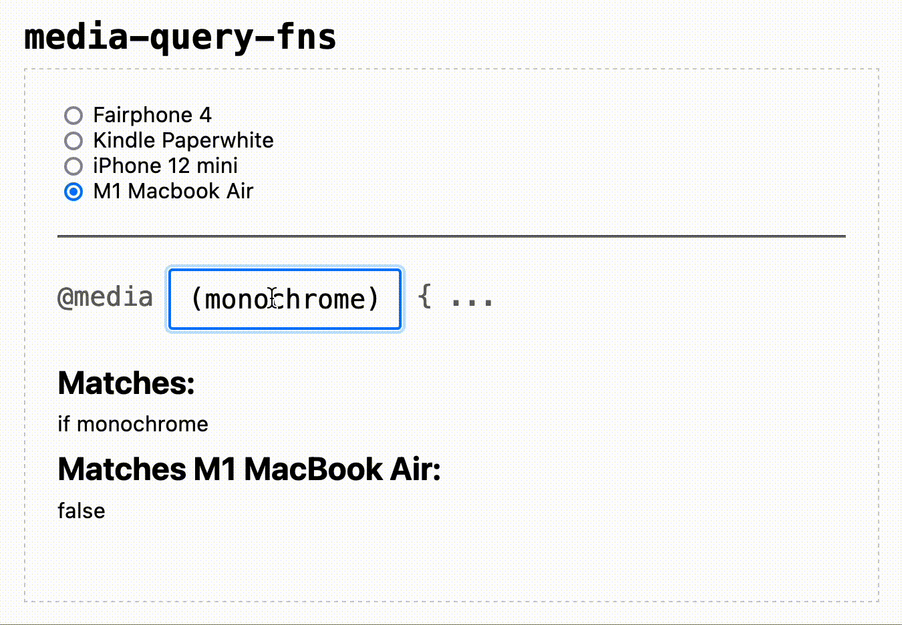

# `media-query-fns`


[](https://packagephobia.com/result?p=media-query-fns)



Cool functions for media queries. [**Spec-compliant**](https://www.w3.org/TR/mediaqueries-5).

---

## Install

This package is available from the `npm` registry.

```sh
npm install media-query-fns
```

## Usage

Supports JavaScript + TypeScript:

```ts
import { compileQuery, matches, toEnglishString } from "media-query-fns";

// returns data that can be used to interpret the query
const maxWidthQuery = compileQuery(`@media (max-width: 1200px)`);
// (throws if invalid query syntax)

const testEnv = (widthPx = 1280, heightPx = 800) => ({
  widthPx,
  heightPx,
  deviceWidthPx: widthPx,
  deviceHeightPx: heightPx,
  dppx: 2,
});
console.log(matches(maxWidthQuery, testEnv(1280))); // false
console.log(matches(maxWidthQuery, testEnv(1000))); // true

const complexQuery = compileQuery(`@media screen and (monochrome) and (orientation)`);
console.log(matches(complexQuery, testEnv()));
// true

console.log(toEnglishString(maxWidthQuery));
// 'if width ≤ 1200px'
console.log(toEnglishString(complexQuery));
// 'if (is screen AND monochrome)'
// note: (orientation) without "landscape" or "portrait" is always true, so it's removed for brevity
```

Can also be imported via `require("media-query-fns")`.

## Contributing

- PRs welcome and accepted, simply fork and create
- Issues also very welcome
- Treat others with common courtesy and respect 🤝

Dev environment (for contributing) requires:

- node >= 16.14.0
- npm >= 6.8.0
- git >= 2.11

## Licence

MIT
